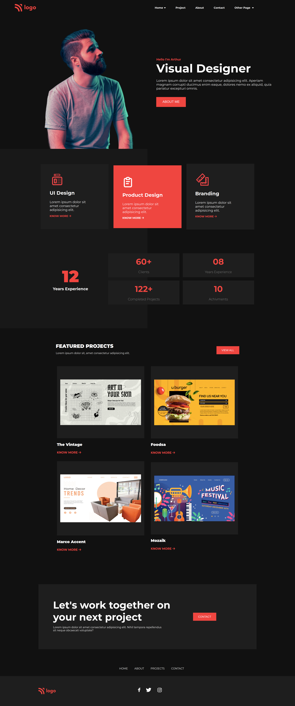

# Product Design Landing Page

- This project is a Product Design landing page.This website is designed using pure HTML and CSS. Also, I made this website responsive.

- It took me 5-6hrs to make this project and 1.5hr to make it responsive. Please find link of the project below:

---

## Breakpoints

- I have taken **Two** breakpoints to make it responsive.

  - At **768px**
  - At **480px**

## Screenshot

- Desktop View

- Mobile View

---

## 🛠 Skills learned

HTML, CSS, Responsive site

---

## 🚀 About Me

### Hey, I am Yasir lambawala

- I am born and brought up in Vadodara, Gujarat. I have done my Btech at GTU university and I am currently learning Web-development.

---

## Feedback

- If you have any feedback, please reach me at lambawalay@gmail.com
